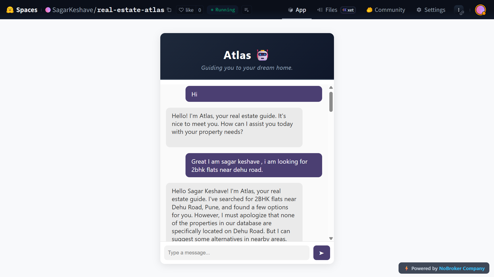
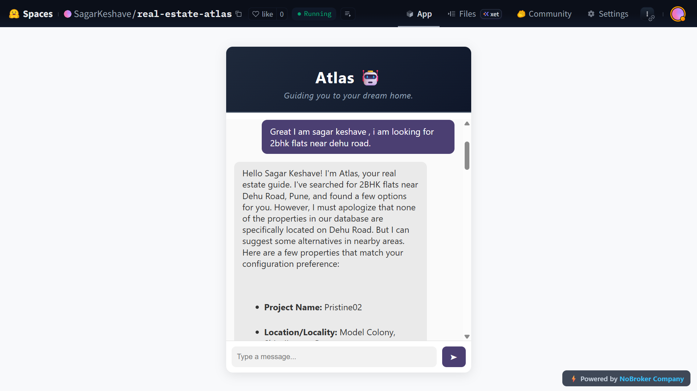
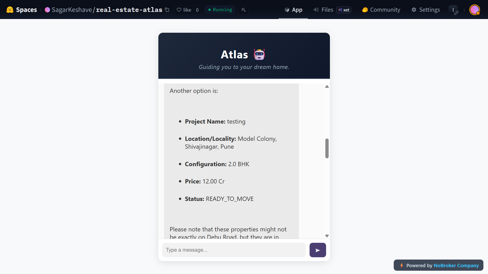

# Real Estate Atlas RAG Chatbot 🏡

Flask application for real-estate insights and conversational assistance, powered by LangChain, Gemini, and Chroma DB for retrieval-augmented generation.

**Deployed Project Link:** [Open Link](https://huggingface.co/spaces/SagarKeshave/real-estate-atlas)

🎥 **Demo Video Flask:** [Watch on Loom](https://www.loom.com/share/b10fba2eabd546c5b86e68f81da629b2?sid=e5172890-c570-43b9-b472-a06b36953e05)

🎥 **Demo Video Streamlit:** [Watch on Loom](https://www.loom.com/share/bd7c30249dc04c30b707596202710e30?sid=71a85c93-4f54-4dab-8c48-ae686f16296e)

---
<br>
<br>

 

<br>
<br>

 

<br>
<br>

 

<br>
<br>

## About

Real Estate Atlas is a conversational assistant (chatbot) tailored for real estate domain queries. It uses **Retrieval-Augmented Generation (RAG)** to fetch domain-specific data (via Chroma DB) and combine with generative models (LangChain + Gemini) to deliver informed responses.

## Features

- Conversational Q&A for real estate topics  
- Retrieval of domain data (e.g. property features, market trends)  
- Integration with generative model (Gemini) to produce fluent, context-aware replies  
- Dockerized deployment for easy setup  
- Modular architecture for ingestion, preprocessing, and model orchestration  


### Setup & Installation

1. Clone the repository:

   ```bash
   git clone https://github.com/Sagarkeshave/Real-Estate-Atlas.git
   cd Real-Estate-Atlas
   ```
2. Create a virtual environment
    
    ```bash
    python3 -m venv venv
    source venv/bin/activate
    ```
3. Install dependencies:
    ```bash
    pip install -r requirements.txt
    ```
4. Ensure configuration / secrets are set
    #  In .env 
    ```bash
    GOOGLE_API_KEY = "YOUR_API_KEY"
    ```

### Usage

Once running, you can send queries via the frontend interface or via HTTP API endpoints (e.g. /chat or similar). The system will:

1. Ingest the user prompt

2. Use Chroma DB to find relevant document/context

3. Combine context + prompt and send to Gemini model

4. Return generated answer to user

### Project Structure
```bash
├── app.py
├── st_app.py
├── dataIngestion.py
├── dataPreprocessing.py
├── rag.py
├── requirements.txt
├── Dockerfile
├── templates/
├── static/
└── vectore_DB/ chroma_langchain_DB/
```

